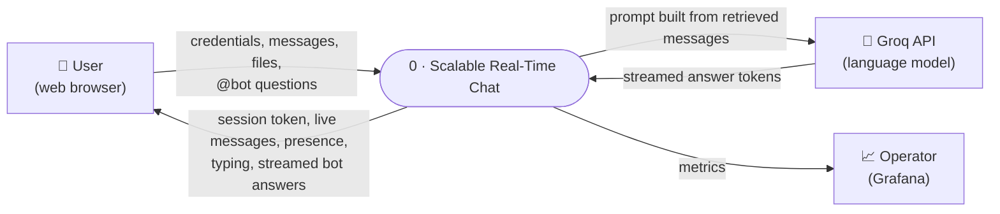
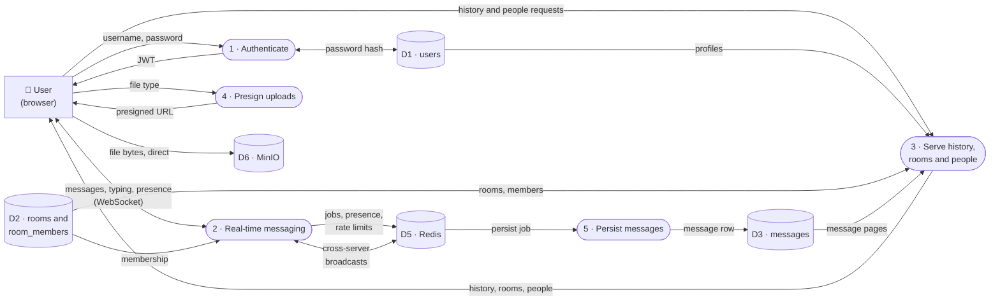
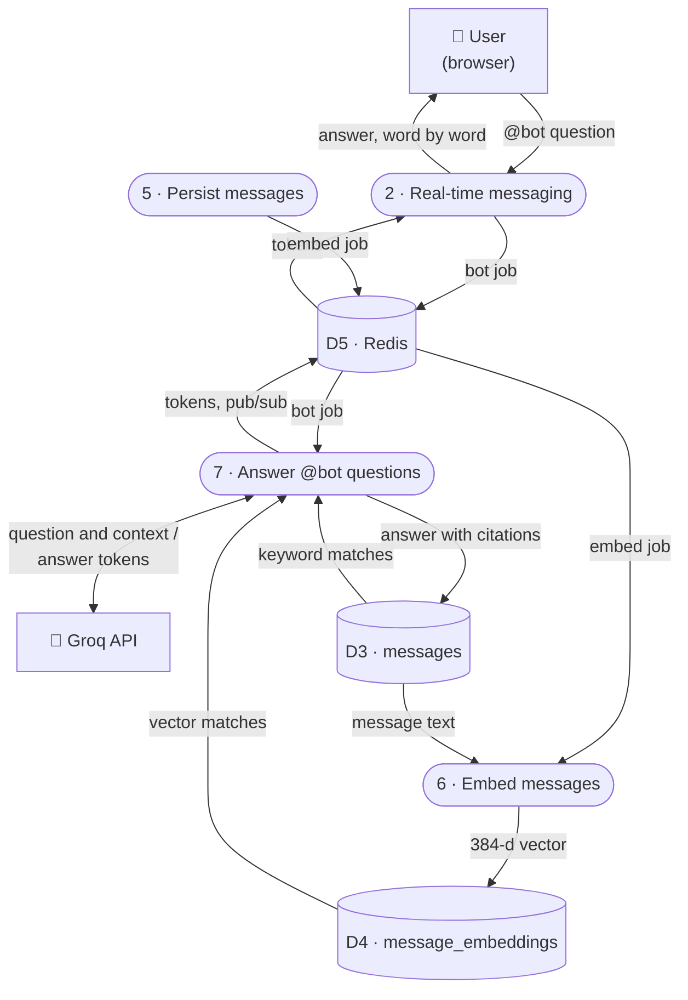
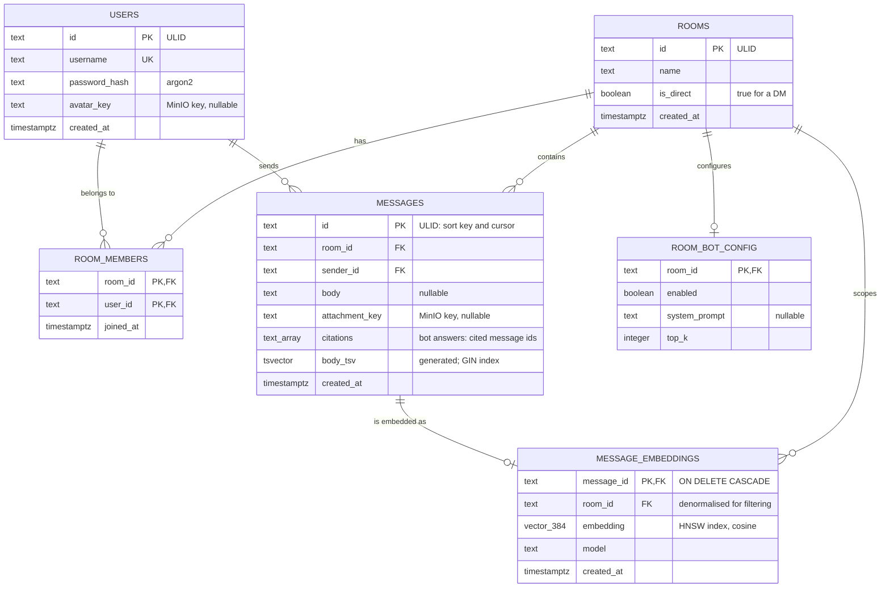

# Scalable Real-Time Chat

A real-time chat application built as a **scalability study**: two Node.js servers behind a load
balancer, asynchronous persistence, cursor pagination over half a million messages, and an `@bot`
that answers questions from a room's own history using hybrid retrieval (RAG).

The goal was not a feature-complete messenger but to show, with measurements, how the system behaves
under horizontal scaling, deep history and semantic search. The measured results — including the
predictions they did *not* support — are in [`docs/benchmarks.md`](docs/benchmarks.md).

---

## Contents

- [Features](#features)
- [Architecture](#architecture)
  - [Data flow diagram — Level 0](#data-flow-diagram--level-0-context)
  - [Data flow diagram — Level 1](#data-flow-diagram--level-1)
- [Data model](#data-model)
  - [ER diagram](#er-diagram)
  - [State outside Postgres](#state-outside-postgres)
- [Tech stack](#tech-stack)
- [Getting started](#getting-started)
- [Using the bot](#using-the-bot)
- [Project structure](#project-structure)
- [API](#api)
- [Testing](#testing)
- [Measured results](#measured-results)
- [Documentation](#documentation)
- [Known limitations](#known-limitations)

---

## Features

**Chat**
- Rooms and one-to-one direct messages, with live delivery over WebSockets
- Optimistic sending: messages appear instantly, then confirm as delivered, or offer a retry
- Infinite scrollback through 500k+ messages using cursor pagination (never `OFFSET`)
- File and image attachments uploaded straight from the browser to object storage
- Typing indicators and online presence that stay correct across both servers
- Profile photos, a people directory, profile cards, and clickable links
- Light, dark and system themes; responsive down to mobile

**Scaling**
- Two API servers behind nginx (`least_conn`), with the Socket.IO Redis adapter delivering messages
  between users on different servers
- Messages persisted by a background worker through a BullMQ queue, keeping database writes off the
  real-time path
- Per-socket and per-user rate limits; WebSocket upgrades checked against an Origin allow-list
- Prometheus metrics and a provisioned Grafana dashboard

**`@bot` — questions over room history**
- Ask `@bot when is the offsite?` in any room; the answer streams in word by word
- Hybrid retrieval: Postgres full-text search plus pgvector similarity, fused with Reciprocal Rank Fusion
- Every answer cites the messages it drew from; clicking a citation jumps to that message, even deep in history
- Answers only from the room you're in, and only if you're a member — enforced *before* the search runs,
  and covered by an automated test

---

## Architecture

Two rules shape the design:

1. **The real-time servers never write to Postgres on the hot path.** They validate, broadcast and
   acknowledge a message, then hand it to a queue; a worker persists it.
2. **The real-time servers never run an AI model.** Embedding and generation happen in a separate RAG
   worker, which streams answers back to the servers through Redis.

### Data flow diagram — Level 0 (context)

The whole system as one process, and what crosses its boundary.



### Data flow diagram — Level 1

Level 0 broken into its eight processes (rounded), six data stores (cylinders) and external entities
(rectangles). It is drawn in two parts so each stays legible; process and store numbers are shared.

**Level 1a — messaging, history and uploads**

Process 8 is left out of the drawing: Prometheus scrapes `/metrics` from both API servers and Grafana shows the dashboard to the Operator. It reads counters only, never message data.



**Level 1b — `@bot` and search**



| # | Process | Runs in | What it does |
|---|---|---|---|
| 1 | Authenticate | node-1 / node-2 | Registers and signs users in (argon2), issues and refreshes short-lived JWTs |
| 2 | Real-time messaging | node-1 / node-2 | Socket.IO: validates and broadcasts messages, acknowledges senders, relays typing and presence, spots `@bot` |
| 3 | History, rooms, people | node-1 / node-2 | REST: cursor-paginated history (`before` / `after` / `around`), rooms, DMs, member lists, user search |
| 4 | Presign uploads | node-1 / node-2 | Issues presigned MinIO URLs; the file bytes never pass through Node |
| 5 | Persist messages | `worker` container | Writes queued messages to Postgres, then queues them for embedding |
| 6 | Embed messages | RAG worker (host) | Runs `bge-small-en-v1.5` locally on CPU and stores 384-dimension vectors |
| 7 | Answer `@bot` questions | RAG worker (host) | Checks membership, retrieves (keyword + vector, fused), prompts Groq, streams the answer, saves it with citations |
| 8 | Collect metrics | Prometheus + Grafana | Scrapes both API servers and shows the provisioned dashboard |

---

## Data model

### ER diagram



Design notes:

- **ULIDs as primary keys.** A ULID is time-ordered, so one column serves as the primary key, the sort
  order and the pagination cursor. History is read with `WHERE room_id = $1 AND id < $cursor ORDER BY id
  DESC LIMIT 50`, backed by the composite index `(room_id, id DESC)`.
- **`message_embeddings.room_id` is duplicated on purpose.** The room filter has to sit inside the vector
  search's own `WHERE` clause; filtering results afterwards would reveal that matching content exists in
  rooms the asker cannot see.
- **`messages.citations`** holds the ids of the messages a bot answer was drawn from, so citation chips
  survive a reload. It is an array rather than a foreign key.
- **The bot is an ordinary row in `users`** (`id = 'bot'`), created by migration with an unusable password.
- Types shown as `text_array` and `vector_384` are `text[]` and `vector(384)` in Postgres.

### State outside Postgres

| Store | Key or name | Holds |
|---|---|---|
| Redis | `online:<userId>` | Set of `<nodeId>\|<socketId>` — one entry per live connection |
| Redis | `online-node:<nodeId>` | Connections held by one server, so it can clear them after a crash |
| Redis | `bot:rl:<userId>:<minute>` | Per-user `@bot` rate limit (5 a minute) |
| Redis | `bot:qemb:<roomId>:<hash>` | Cached question embedding, 5-minute TTL |
| Redis | BullMQ `persist-message`, `embed-message`, `bot-query` | Background job queues |
| Redis | pub/sub `bot:relay` + Socket.IO adapter channels | Streaming answers and messages between servers |
| MinIO | `attachments/<roomId>/<ulid>-<name>.<ext>` | Message attachments |
| MinIO | `attachments/avatars/<userId>/<ulid>.<ext>` | Profile photos |

---

## Tech stack

| Layer | Technology |
|---|---|
| Client | React 18, TypeScript, Vite, Tailwind CSS v4, react-virtuoso, Socket.IO client |
| API | Node.js, Express, Socket.IO with `@socket.io/redis-adapter`, Zod, Drizzle ORM, argon2, JWT |
| Data | PostgreSQL 16 with pgvector, Redis 7, MinIO |
| Jobs | BullMQ |
| AI | `bge-small-en-v1.5` via transformers.js (local, CPU) for embeddings; Groq `openai/gpt-oss-120b` for answers |
| Infrastructure | Docker Compose, nginx, Prometheus, Grafana, k6 |
| Tests | Vitest |

It is an npm workspaces monorepo: `client`, `server`, and `packages/shared`, which holds the
Socket.IO event types and constants used by both sides.

---

## Getting started

### Prerequisites

- **Node.js 20 or later**
- **Docker Desktop** (on Windows this uses WSL 2)
- Optional: a free **[Groq](https://console.groq.com/keys) API key**, for `@bot` answers

### 1. Install and configure

```bash
git clone https://github.com/kartiksingh0074/chat-application.git
cd chat-application
npm install
cp .env.example server/.env
```

To enable bot answers, open `server/.env` and set `GROQ_API_KEY=gsk_...`. Everything else — chat,
uploads, embeddings, retrieval — works without it.

### 2. Start the infrastructure

```bash
docker compose up -d --build
```

This starts nine containers: Postgres, Redis, MinIO, two API servers, the persist worker, nginx,
Prometheus and Grafana.

### 3. Prepare the database and storage

```bash
npm run db:migrate      # create the schema
npm run storage:init    # create the MinIO bucket
npm run seed            # demo users alice and bob, and a #general room
```

### 4. Run the web client

```bash
npm run dev -w client -- --strictPort
```

Open **http://localhost:5173** and sign in as **`alice`** or **`bob`**, password **`password123`**.
Use two browser windows to chat between them.

`--strictPort` matters: the API only accepts WebSocket connections from `http://localhost:5173`, so if
Vite silently moved to another port, the page would load but no messages would send.

### Services and ports

| URL | Service |
|---|---|
| http://localhost:5173 | Web client |
| http://localhost:8080 | API through nginx (REST + WebSocket) |
| http://localhost:9001 | MinIO console (`minioadmin` / `minioadmin123`) |
| http://localhost:3000 | Grafana (`admin` / `admin`) |
| http://localhost:9090 | Prometheus |
| `localhost:5433` | Postgres (`chatapp` / `chatapp`) |
| `localhost:6379` | Redis |

These credentials are local development defaults. Change them before running this anywhere else.

> **After rebuilding the API servers,** recreate nginx too:
> `docker compose up -d --force-recreate nginx`. nginx resolves the servers' addresses once at startup,
> so without this it silently sends all traffic to one server.

---

## Using the bot

The bot needs messages to search and a worker to answer. The repository includes a demo corpus of
about 4,000 messages across four rooms, with known answers planted in them:

```bash
npm run rag:seed -w server
npm run rag:backfill -w server -- --room rag-eng-platform --room rag-incidents --room rag-product --room rag-team
npm run rag:worker -w server
```

The first run downloads the embedding model (~130 MB) once. Keep `rag:worker` running — it answers
questions and embeds new messages as they arrive.

Then open **#incidents** and try:

```
@bot How did the attacker get in?
```

A few more: `@bot why was kestrel_search disabled?` in **#product**, `@bot what is PLAT-2208?` in
**#eng-platform**, `@bot when is the offsite?` in **#team**. When the history doesn't contain an answer,
the bot says so rather than guessing.

---

## Project structure

```
chat-application/
├── client/                 React web app
│   ├── public/fonts/       Inter (self-hosted, SIL Open Font License)
│   └── src/
│       ├── components/     Sidebar, message list, composer, bot answers, dialogs
│       ├── hooks/          Messages, rooms, presence, typing, bot streams, uploads
│       ├── pages/          Sign-in, chat, find people, settings
│       └── ui/             Design primitives and icons
├── server/
│   ├── src/
│   │   ├── auth/           Registration, login, JWT
│   │   ├── bot/            Prompt building, Groq streaming, answer orchestration, Redis relay
│   │   ├── db/             Drizzle schema and migrations
│   │   ├── presence/       Online status across servers
│   │   ├── queues/         BullMQ queues
│   │   ├── rag/            Embeddings, retrieval, RRF, evaluation corpus and runner
│   │   ├── rooms/          Rooms, DMs, paginated history
│   │   ├── socket/         Socket.IO server and event handlers
│   │   ├── uploads/        Presigned upload URLs
│   │   ├── users/          People search and profiles
│   │   └── worker/         Persist worker and RAG worker
│   └── test/               Vitest suites
├── packages/shared/        Socket event types and shared constants
├── nginx/                  Load balancer config
├── prometheus/  grafana/   Metrics scraping and dashboard
├── k6/                     Load-test script
├── docs/                   Benchmarks, design decisions, evaluation results
├── docker-compose.yml
└── PROJECT.md              Original specification
```

---

## API

REST endpoints are served on port 8080 through nginx. All except register, login and health need an
`Authorization: Bearer <token>` header.

| Method | Path | Purpose |
|---|---|---|
| `POST` | `/auth/register` | Create an account |
| `POST` | `/auth/login` | Sign in and get a token |
| `POST` | `/auth/refresh` | Swap a valid token for a fresh one |
| `GET` | `/auth/me` | The signed-in user |
| `GET` | `/rooms` | Your rooms and DMs |
| `POST` | `/rooms` | Create a room |
| `POST` | `/rooms/dm` | Open (or reuse) a direct message |
| `GET` | `/rooms/:id/messages` | History: `?before=`, `?after=` or `?around=` a message id, and `?limit=` |
| `GET` | `/rooms/:id/members` | Members, with who is online |
| `GET` | `/users?q=` | Search people |
| `GET` | `/users/:id` | A profile |
| `PATCH` | `/users/me` | Set or clear your profile photo |
| `POST` | `/uploads/presign` | Presigned URL for an attachment |
| `POST` | `/uploads/avatar-presign` | Presigned URL for a profile photo |
| `GET` | `/health` | Liveness, with the answering server's id |
| `GET` | `/metrics` | Prometheus metrics |

**Socket.IO events**, typed in [`packages/shared/src/events.ts`](packages/shared/src/events.ts):

| Direction | Events |
|---|---|
| Client → server | `room:join`, `room:leave`, `message:send`, `typing:start`, `typing:stop` |
| Server → client | `message:new`, `message:ack`, `presence:update`, `typing:update`, `bot:token`, `bot:complete`, `bot:error`, `error` |

A message starting with `@bot` is also a question; there is no separate event for asking.

---

## Testing

```bash
npm test
```

129 tests: 91 on the server and 38 on the client. Some server suites run against the real Postgres and
Redis from Docker Compose, so start the infrastructure first. They include:

- a **room-isolation test** — the same vector is planted in a private room and in the searcher's own
  room, and the search must never return the private one
- **presence recovery** — a server dies mid-connection, and the user must still go offline once the
  tab closes
- **evaluation integrity** — question categories are checked with Postgres's own stemmer, and filler
  messages must never contain a planted answer

---

## Measured results

Full methodology, tables and caveats are in [`docs/benchmarks.md`](docs/benchmarks.md). Highlights:

| Claim | Result |
|---|---|
| Cursor pagination beats `OFFSET` for deep history | **Confirmed** — 12.6× faster at 100,000 messages deep |
| Async persistence prevents message loss during an outage | **Confirmed** — 100 of 100 messages recovered |
| Two servers lower delivery latency | **Not supported** at the load tested — neither server was saturated |
| Hybrid retrieval beats keyword and vector search | **Not supported** as specified — keyword matching's all-words rule returned nothing for 22 of 30 questions |
| Vector search wins on paraphrased questions | **Confirmed**, with a low ceiling — 29% vs 0% |
| A non-member cannot retrieve a room's messages | **Confirmed** by automated test |

Retrieval over the demo corpus (recall@10 / MRR / p95):

| Mode | recall@10 | MRR | p95 |
|---|---|---|---|
| Keyword | 26.7% | 0.267 | 2.2 ms |
| Vector | 61.7% | 0.633 | 6.8 ms |
| Hybrid (RRF) | 61.7% | 0.633 | 7.1 ms |

Run the evaluation yourself with `npm run rag:eval -w server`.

---

## Documentation

| File | Contents |
|---|---|
| [`PROJECT.md`](PROJECT.md) | The original specification and build phases |
| [`docs/benchmarks.md`](docs/benchmarks.md) | All five experiments, with methods and caveats |
| [`docs/decisions.md`](docs/decisions.md) | Why each non-obvious choice was made, including bugs found along the way |
| [`docs/rag-eval/results.json`](docs/rag-eval/results.json) | Raw retrieval evaluation output |
| [`docs/ui-roadmap.md`](docs/ui-roadmap.md) | UI work: what shipped and what was deferred |

---

## Known limitations

- **Retrieval is imperfect.** The right message is found for about 62% of the benchmark questions, and the
  demo corpus's templated filler makes that a harsh test.
- **Prompt injection is reduced, not prevented.** Retrieved messages are marked as untrusted in the prompt.
- **The RAG worker runs outside Docker**, so `@bot` stops answering after a restart until
  `npm run rag:worker -w server` is run again.
- **Presence can go stale** if a server is removed permanently; its connections are cleared only when a
  server with the same id starts.
- **Not built:** end-to-end encryption, reactions, threads, voice and video (out of scope by design), and
  replaying missed messages after a reconnect.
- One benchmark from the specification is still to be measured: embedding 10,000 messages without slowing
  the real-time servers.
