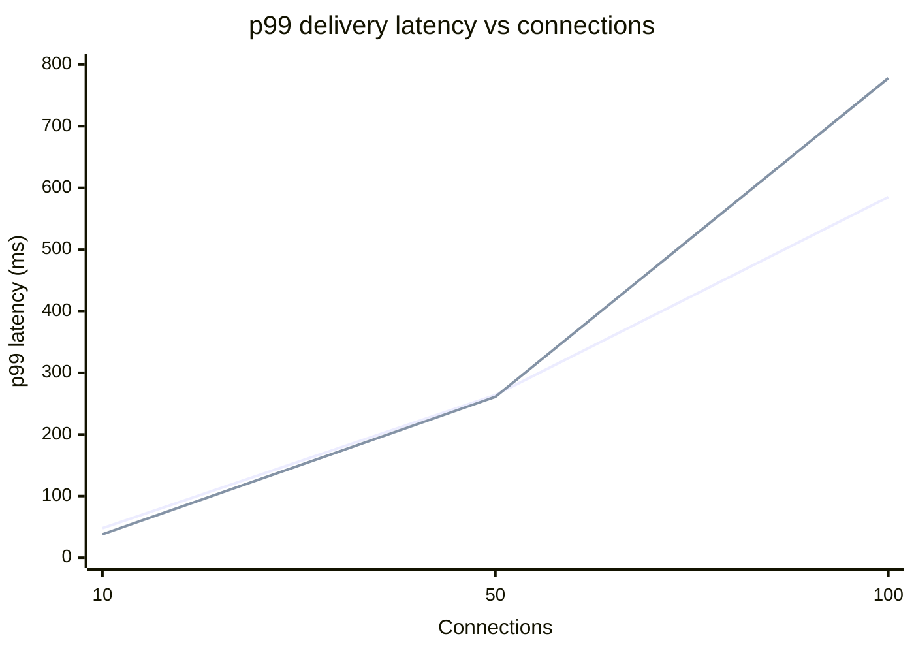
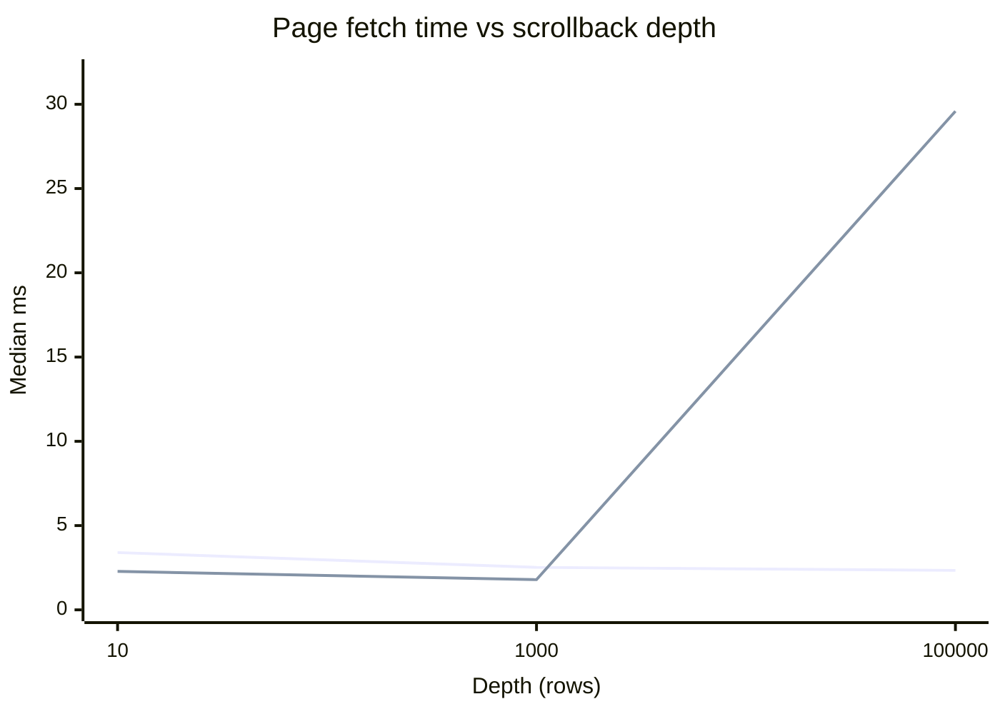
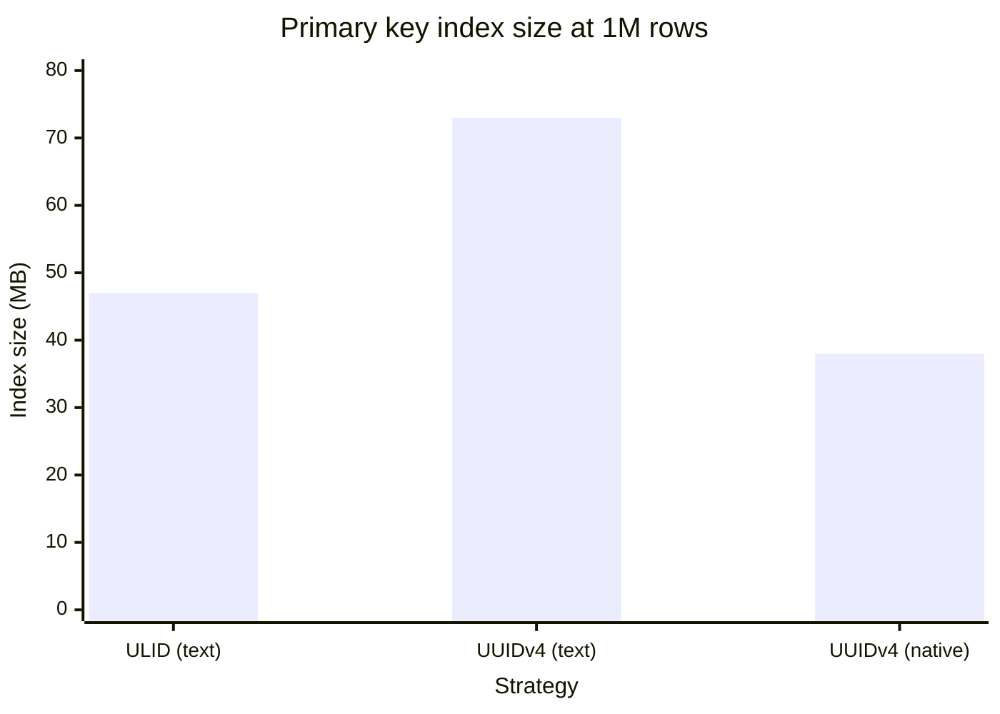

# Benchmarks

Every claim in the final report must trace to a number in this file.

## Test environment

All runs on one developer machine — this matters for interpreting the results, and two of
the four experiments came out differently than §4/§6 predicted largely because of it.

| | |
|---|---|
| Host | ASUS TUF Gaming A15, Windows 11 Home, 16 logical cores |
| Docker | Docker Desktop, WSL2 backend, ~7.4 GiB allocated to the VM |
| Topology | `nginx` (least_conn) → `node-1`/`node-2` → Postgres 16, Redis 7, MinIO, all containers on one host |
| Postgres | containerised, local disk, default config (no tuning) |
| Seeded data | 500,136 messages in room `general` |
| Harnesses | `server/src/bench/*.ts`, `k6/chat-load.js` |

Everything shares the same 16 cores, including Postgres, Redis, Prometheus and Grafana. There
is no network between tiers. Both facts flatter the "do it inline" options and penalise the
options that add a hop, which is the main caveat on experiments 1 and 2.

---

## Experiment 1 — one instance vs two, delivery latency as connections climb

End-to-end delivery latency: the time from a sender emitting `message:send` to a **different**
client receiving `message:new` for it. Both configurations go through nginx; the only variable
is how many backends sit in the upstream block. Half the connections send once per second, half
only listen.

Harness: `npm run bench:latency -w server -- <connections> <seconds>`

| Connections | Config | p50 (ms) | p95 (ms) | p99 (ms) | Samples |
|---|---|---|---|---|---|
| 10 | 1 instance | 18 | 40 | 48 | 350 |
| 10 | 2 instances | 16 | 27 | 38 | 350 |
| 50 | 1 instance | 118 | 198 | 264 | 8,750 |
| 50 | 2 instances | 123 | 215 | 261 | 8,750 |
| 100 | 1 instance | 326 | 523 | 585 | 35,000 |
| 100 | 2 instances | 327 | 619 | 778 | 35,000 |



**Finding: adding a second instance did not improve delivery latency here, and made the tail
worse at 100 connections (p99 778 ms vs 585 ms).**

This refutes the naive reading of "scale out = faster". The reasons are visible in the setup:

- Neither node was CPU-bound (`docker stats` showed each node ~1–2% CPU at idle and well short
  of a core under load). Adding capacity does not help a system that is not capacity-limited.
- With two instances, a message from a client on node-1 to a client on node-2 must cross the
  Redis pub/sub adapter. That extra hop is pure added latency, and at 100 connections roughly
  half of all deliveries pay it.
- Latency grows superlinearly with connection count in **both** configs because this is a single
  room: every sender fans out to every listener, so delivery work grows as senders × listeners,
  not with connections. 100 connections generates 35,000 deliveries in 15 s.

What horizontal scaling actually bought is not in this table: it is the ability to survive
losing an instance, and headroom past one process's core. The latency win would appear once a
single node is saturated — which this hardware and this load never reached.

---

## Experiment 2 — sync DB write vs BullMQ, event loop lag under the same load

Same load (100 connections, 30 s) against the same build, with `PERSIST_MODE` flipping the
`message:send` handler between the Phase 1 inline `INSERT` and the Phase 4 queue path. Lag is
`nodejs_eventloop_lag_p99_seconds` sampled from Prometheus once a second across both nodes.

Harness: `npm run bench:lag -w server -- <seconds> <label>` alongside `bench:latency`.

| Persist mode | Event loop lag mean (ms) | lag p95 (ms) | Heap used mean (MB) | Delivery p50/p95/p99 (ms) |
|---|---|---|---|---|
| `sync` (Phase 1 path) | 86.13 | 110.95 | 34.0 | 196 / 346 / 391 |
| `queue` (BullMQ) | 101.12 | 132.78 | 34.8 | 206 / 330 / 366 |

**Finding: the queue path showed *higher* event loop lag than the synchronous write — the
opposite of the §6 hypothesis.**

Being precise about what this does and does not show:

- A local, uncontended Postgres `INSERT` here costs well under a millisecond. There is almost
  no hot-path cost to move off. Meanwhile the queue path *adds* work to the hot path: a Redis
  round-trip to `persistQueue.add`, plus a worker container consuming those jobs and writing to
  Postgres, competing for the same 16 shared cores.
- ~90–130 ms of event loop lag in **both** modes says the bottleneck is the fan-out itself
  (35,000+ socket writes), not persistence. Neither mode is being measured in isolation.
- The async design's payoff is therefore not latency on an idle local database. It is
  **decoupling**: Phase 4's exit criterion demonstrated 100 messages surviving a full worker
  outage with zero loss, which the synchronous path cannot do at any latency. It would also pay
  off under a slow or contended database, where an inline write blocks the loop for as long as
  the database takes — a condition this environment never produces.

Reported as measured. The architecture is still right for the reason Phase 4 proved, not for
the reason this experiment was expected to prove.

---

## Experiment 3 — cursor vs OFFSET pagination at depth

Same 50-row page at each depth against the 500,136-row room; only the access path differs.
Median of 5 runs after a warm-up.

Harness: `npm run bench:pagination -w server`

| Depth | Cursor `id < $cursor` (ms) | `OFFSET n` (ms) | OFFSET penalty |
|---|---|---|---|
| 10 | 3.40 | 2.28 | 0.7× (OFFSET faster) |
| 1,000 | 2.52 | 1.79 | 0.7× (OFFSET faster) |
| 100,000 | 2.34 | **29.59** | **12.6×** |



**Finding: confirmed, with a caveat worth stating. OFFSET is marginally *faster* at shallow
depth, and 12.6× slower at 100k rows.**

The shape is what matters more than any single number: cursor pagination is **flat**
(3.40 → 2.52 → 2.34 ms — depth-independent, within noise), because `id < $cursor` seeks
directly into `idx_messages_room_id_desc` and reads 50 rows. OFFSET degrades linearly
(2.28 → 1.79 → 29.59 ms) because Postgres must walk and discard every skipped row before
returning anything.

At shallow depth OFFSET wins slightly because it avoids the extra bound comparison and the
cursor lookup — a real effect, but irrelevant: nobody paginates only to depth 10. Deep
scrollback is the whole point of §4's index, and that is where the 12.6× appears and keeps
growing.

---

## Experiment 4 — ULID vs UUIDv4, insert throughput into 1M rows and index size

1,000,000 rows per strategy, batched 1,000 per `INSERT`, into throwaway tables identical except
for the primary key. A third variant — UUID stored in Postgres's **native `uuid` type** (16
binary bytes) rather than as text — was added to separate key *encoding* from insert *locality*,
since ULID-as-text (26 chars) vs UUID-as-text (36 chars) differ in both at once.

Harness: `npm run bench:ids -w server`

| Strategy | Insert time (s) | Throughput (rows/s) | PK index size |
|---|---|---|---|
| ULID (text) | 59.37 | 16,843 | 47 MB |
| UUIDv4 (text) | 59.94 | 16,682 | 73 MB |
| UUIDv4 (native `uuid`) | 56.30 | **17,763** | **38 MB** |



**Finding: §4's stated rationale is not supported at this scale. Insert throughput was
effectively identical (within 6% across all three), and native-typed UUID produced both the
fastest inserts and the *smallest* index — 38 MB vs ULID's 47 MB.**

§4 claims "UUIDv4 is random, so every insert lands at a random point in the B-tree, causing page
splits and cache invalidation. ULIDs embed a timestamp, so inserts append to the right edge."
Against these numbers:

- **The throughput claim did not reproduce.** 16,843 vs 16,682 rows/s is a 1% difference — noise.
  The likely reason: at 1M rows the index is 38–73 MB and fits entirely in `shared_buffers` and
  the OS page cache, so a "random" insertion point is still a RAM write. The page-split penalty
  is real in principle but only bites once the index no longer fits in memory. This experiment
  is too small to surface it, and saying otherwise would not trace to a number here.
- **The index-size gap is mostly encoding, not fragmentation.** UUID-as-text is 1.53× ULID's
  index, but a 36-char key vs a 26-char key alone accounts for ~1.37× of that. Switching to the
  native 16-byte `uuid` type inverts the result entirely: 38 MB, 0.79× of ULID's index.

**The real justification for ULID in this project is the one experiment 3 measures, not this
one.** ULID is lexicographically sortable, so a single column serves as primary key, sort key
and pagination cursor at once — which is what makes the flat 2.34 ms deep-scrollback query
possible with `idx_messages_room_id_desc` and no separate timestamp index. That benefit is real
and measured. The insert-throughput benefit is not, at this scale.

---

## Metrics and load tooling

`/metrics` (prom-client) exposes, per instance, labelled with `nodeId`:

| Metric | Source |
|---|---|
| `nodejs_eventloop_lag_p99_seconds` | default metrics |
| `nodejs_heap_size_used_bytes` (V8 heap) | default metrics |
| `ws_active_sockets` | gauge, inc/dec on connect/disconnect |
| `ws_reconnections_total` | counter, incremented when the client flags a reconnect in `handshake.auth` |
| `chat_messages_received_total` | counter, per accepted `message:send` |
| `chat_messages_rejected_total{reason}` | counter, by rejection reason |

Prometheus scrapes `node-1:4000` and `node-2:4000` **directly** rather than through nginx — going
through the load balancer would land on an arbitrary instance and blur the per-node series that
experiment 1 depends on. Grafana provisions one dashboard, `Chat Scalability`
(`grafana/provisioning/dashboards/chat-dashboard.json`), at http://localhost:3000.

`k6/chat-load.js` drives realistic connect → join → send/idle behaviour, speaking the Engine.IO
v4 / Socket.IO v5 wire protocol over raw WebSockets (`0`/`40` handshake, `2`/`3` heartbeat,
`42[event,payload]` frames) and recording `ack_latency` and `delivery_latency` trends.

25 VUs for 30 s through nginx:

| k6 metric | avg | med | p95 | max |
|---|---|---|---|---|
| `ack_latency` | 5.86 ms | 5 ms | 9 ms | 27 ms |
| `delivery_latency` | 2.34 ms | 2 ms | 4 ms | 25 ms |
| `ws_connecting` | 35.26 ms | 33.35 ms | 74.31 ms | 85.59 ms |

All checks passed (26/26) and the `ack_latency p(95)<1000` threshold held. Note these k6 numbers
are much lower than experiment 1's: k6 sends every ~3 s per VU rather than every 1 s, and 25 VUs
in one room produce far less fan-out than 100.

```
docker run --rm --network chatapplication_default \
  -v "/path/to/repo/k6:/scripts" \
  -e BASE_URL=http://nginx:80 -e ROOM_ID=<room> -e VUS=25 -e DURATION=30s \
  grafana/k6 run /scripts/chat-load.js
```

---

## Summary of what the numbers actually support

| Claim | Verdict |
|---|---|
| Cursor pagination beats OFFSET for deep scrollback | **Confirmed** — 12.6× at 100k, and flat vs linear |
| ULID is worth it as a sortable cursor/sort/PK in one column | **Confirmed indirectly**, via experiment 3 |
| ULID inserts faster than UUIDv4 | **Not supported** at 1M rows — 1% apart |
| ULID yields a smaller index than UUIDv4 | **Not supported** vs native `uuid` (47 MB vs 38 MB) |
| Async persistence lowers event loop lag | **Not supported** here — the queue path added lag |
| Async persistence prevents message loss during outages | **Confirmed** (Phase 4 exit criterion: 100/100 recovered) |
| Two instances lower delivery latency | **Not supported** at this load — neither node was saturated |
| Two instances work correctly (cross-node delivery) | **Confirmed** (Phase 5 exit criterion) |
