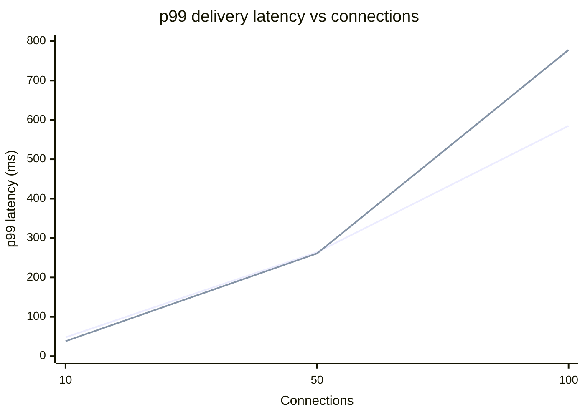
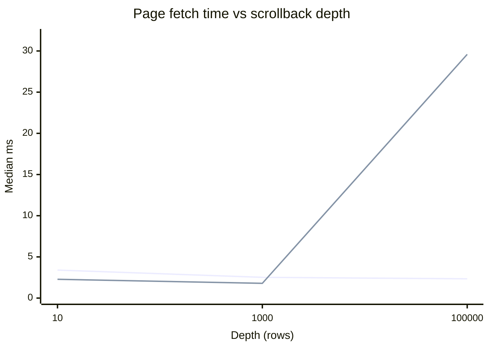
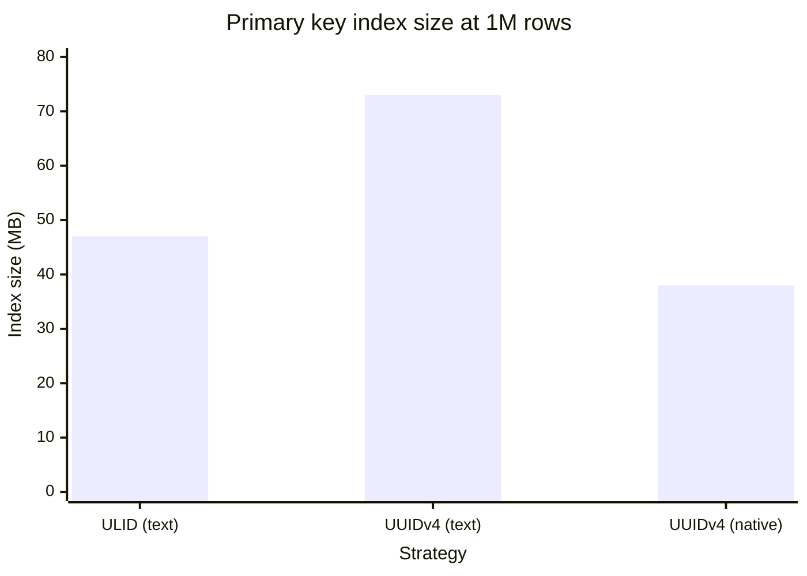

# Benchmarks

Every claim in the final report must trace to a number in this file.

## Test environment

All runs on one developer machine — this matters for interpreting the results, and two of
the four experiments came out differently than §4/§6 predicted largely because of it.

| | |
|---|---|
| Host | ASUS TUF Gaming A15, Windows 11 Home, 16 logical cores |
| Docker | Docker Desktop, WSL2 backend, ~7.4 GiB allocated to the VM |
| Topology | `nginx` (least_conn) → `node-1`/`node-2` → Postgres 16, Redis 7, MinIO, all containers on one host |
| Postgres | containerised, local disk, default config (no tuning) |
| Seeded data | 500,136 messages in room `general` |
| Harnesses | `server/src/bench/*.ts`, `k6/chat-load.js` |

Everything shares the same 16 cores, including Postgres, Redis, Prometheus and Grafana. There
is no network between tiers. Both facts flatter the "do it inline" options and penalise the
options that add a hop, which is the main caveat on experiments 1 and 2.

---

## Experiment 1 — one instance vs two, delivery latency as connections climb

End-to-end delivery latency: the time from a sender emitting `message:send` to a **different**
client receiving `message:new` for it. Both configurations go through nginx; the only variable
is how many backends sit in the upstream block. Half the connections send once per second, half
only listen.

Harness: `npm run bench:latency -w server -- <connections> <seconds>`

| Connections | Config | p50 (ms) | p95 (ms) | p99 (ms) | Samples |
|---|---|---|---|---|---|
| 10 | 1 instance | 18 | 40 | 48 | 350 |
| 10 | 2 instances | 16 | 27 | 38 | 350 |
| 50 | 1 instance | 118 | 198 | 264 | 8,750 |
| 50 | 2 instances | 123 | 215 | 261 | 8,750 |
| 100 | 1 instance | 326 | 523 | 585 | 35,000 |
| 100 | 2 instances | 327 | 619 | 778 | 35,000 |



**Finding: adding a second instance did not improve delivery latency here, and made the tail
worse at 100 connections (p99 778 ms vs 585 ms).**

This refutes the naive reading of "scale out = faster". The reasons are visible in the setup:

- Neither node was CPU-bound (`docker stats` showed each node ~1–2% CPU at idle and well short
  of a core under load). Adding capacity does not help a system that is not capacity-limited.
- With two instances, a message from a client on node-1 to a client on node-2 must cross the
  Redis pub/sub adapter. That extra hop is pure added latency, and at 100 connections roughly
  half of all deliveries pay it.
- Latency grows superlinearly with connection count in **both** configs because this is a single
  room: every sender fans out to every listener, so delivery work grows as senders × listeners,
  not with connections. 100 connections generates 35,000 deliveries in 15 s.

What horizontal scaling actually bought is not in this table: it is the ability to survive
losing an instance, and headroom past one process's core. The latency win would appear once a
single node is saturated — which this hardware and this load never reached.

---

## Experiment 2 — sync DB write vs BullMQ, event loop lag under the same load

Same load (100 connections, 30 s) against the same build, with `PERSIST_MODE` flipping the
`message:send` handler between the Phase 1 inline `INSERT` and the Phase 4 queue path. Lag is
`nodejs_eventloop_lag_p99_seconds` sampled from Prometheus once a second across both nodes.

Harness: `npm run bench:lag -w server -- <seconds> <label>` alongside `bench:latency`.

| Persist mode | Event loop lag mean (ms) | lag p95 (ms) | Heap used mean (MB) | Delivery p50/p95/p99 (ms) |
|---|---|---|---|---|
| `sync` (Phase 1 path) | 86.13 | 110.95 | 34.0 | 196 / 346 / 391 |
| `queue` (BullMQ) | 101.12 | 132.78 | 34.8 | 206 / 330 / 366 |

**Finding: the queue path showed *higher* event loop lag than the synchronous write — the
opposite of the §6 hypothesis.**

Being precise about what this does and does not show:

- A local, uncontended Postgres `INSERT` here costs well under a millisecond. There is almost
  no hot-path cost to move off. Meanwhile the queue path *adds* work to the hot path: a Redis
  round-trip to `persistQueue.add`, plus a worker container consuming those jobs and writing to
  Postgres, competing for the same 16 shared cores.
- ~90–130 ms of event loop lag in **both** modes says the bottleneck is the fan-out itself
  (35,000+ socket writes), not persistence. Neither mode is being measured in isolation.
- The async design's payoff is therefore not latency on an idle local database. It is
  **decoupling**: Phase 4's exit criterion demonstrated 100 messages surviving a full worker
  outage with zero loss, which the synchronous path cannot do at any latency. It would also pay
  off under a slow or contended database, where an inline write blocks the loop for as long as
  the database takes — a condition this environment never produces.

Reported as measured. The architecture is still right for the reason Phase 4 proved, not for
the reason this experiment was expected to prove.

---

## Experiment 3 — cursor vs OFFSET pagination at depth

Same 50-row page at each depth against the 500,136-row room; only the access path differs.
Median of 5 runs after a warm-up.

Harness: `npm run bench:pagination -w server`

| Depth | Cursor `id < $cursor` (ms) | `OFFSET n` (ms) | OFFSET penalty |
|---|---|---|---|
| 10 | 3.40 | 2.28 | 0.7× (OFFSET faster) |
| 1,000 | 2.52 | 1.79 | 0.7× (OFFSET faster) |
| 100,000 | 2.34 | **29.59** | **12.6×** |



**Finding: confirmed, with a caveat worth stating. OFFSET is marginally *faster* at shallow
depth, and 12.6× slower at 100k rows.**

The shape is what matters more than any single number: cursor pagination is **flat**
(3.40 → 2.52 → 2.34 ms — depth-independent, within noise), because `id < $cursor` seeks
directly into `idx_messages_room_id_desc` and reads 50 rows. OFFSET degrades linearly
(2.28 → 1.79 → 29.59 ms) because Postgres must walk and discard every skipped row before
returning anything.

At shallow depth OFFSET wins slightly because it avoids the extra bound comparison and the
cursor lookup — a real effect, but irrelevant: nobody paginates only to depth 10. Deep
scrollback is the whole point of §4's index, and that is where the 12.6× appears and keeps
growing.

---

## Experiment 4 — ULID vs UUIDv4, insert throughput into 1M rows and index size

1,000,000 rows per strategy, batched 1,000 per `INSERT`, into throwaway tables identical except
for the primary key. A third variant — UUID stored in Postgres's **native `uuid` type** (16
binary bytes) rather than as text — was added to separate key *encoding* from insert *locality*,
since ULID-as-text (26 chars) vs UUID-as-text (36 chars) differ in both at once.

Harness: `npm run bench:ids -w server`

| Strategy | Insert time (s) | Throughput (rows/s) | PK index size |
|---|---|---|---|
| ULID (text) | 59.37 | 16,843 | 47 MB |
| UUIDv4 (text) | 59.94 | 16,682 | 73 MB |
| UUIDv4 (native `uuid`) | 56.30 | **17,763** | **38 MB** |



**Finding: §4's stated rationale is not supported at this scale. Insert throughput was
effectively identical (within 6% across all three), and native-typed UUID produced both the
fastest inserts and the *smallest* index — 38 MB vs ULID's 47 MB.**

§4 claims "UUIDv4 is random, so every insert lands at a random point in the B-tree, causing page
splits and cache invalidation. ULIDs embed a timestamp, so inserts append to the right edge."
Against these numbers:

- **The throughput claim did not reproduce.** 16,843 vs 16,682 rows/s is a 1% difference — noise.
  The likely reason: at 1M rows the index is 38–73 MB and fits entirely in `shared_buffers` and
  the OS page cache, so a "random" insertion point is still a RAM write. The page-split penalty
  is real in principle but only bites once the index no longer fits in memory. This experiment
  is too small to surface it, and saying otherwise would not trace to a number here.
- **The index-size gap is mostly encoding, not fragmentation.** UUID-as-text is 1.53× ULID's
  index, but a 36-char key vs a 26-char key alone accounts for ~1.37× of that. Switching to the
  native 16-byte `uuid` type inverts the result entirely: 38 MB, 0.79× of ULID's index.

**The real justification for ULID in this project is the one experiment 3 measures, not this
one.** ULID is lexicographically sortable, so a single column serves as primary key, sort key
and pagination cursor at once — which is what makes the flat 2.34 ms deep-scrollback query
possible with `idx_messages_room_id_desc` and no separate timestamp index. That benefit is real
and measured. The insert-throughput benefit is not, at this scale.

---

## Experiment 5 — RAG retrieval: keyword vs vector vs hybrid (§8.8)

§8.8 asks for recall@10, MRR and p95 latency across three retrieval modes over a labelled
question set, plus embedding cost and index size, and predicts that hybrid beats both arms,
keyword wins on exact names and IDs, and vector wins on paraphrase.

### Setup

| | |
|---|---|
| Corpus | 4 rooms (`eng-platform`, `incidents`, `product`, `team`), **4,070 messages**: 4,000 templated filler, 32 planted answers, 38 hand-written near misses |
| Embedded | 3,336 — the other 734 are under 15 characters ("ok", "lgtm") and skipped per §8.3 |
| Questions | **30**: 10 *identifier*, 12 *paraphrase*, 8 *lexical* |
| Relevance | Strict — only planted answers count, so every score is a lower bound |
| Embedding model | `bge-small-en-v1.5`, fp32, run locally on CPU via transformers.js; query-side prefix only |
| Retrieval | 50 candidates per arm, RRF with k = 60, top_k = 10; each question asked in its answer's room, as a member |
| Timing | One warm pass, then 5 repetitions × 30 questions = 150 samples per mode |
| Machine | AMD Ryzen 7 170, 16 logical cores, 15 GB; Node 24 native on Windows, Postgres in Docker (WSL2) |

**The categories are checked mechanically, not by eye.** `test/ragCorpus.test.ts` intersects
each question with its answer using `to_tsvector('english', …)` — the same tokeniser the keyword
arm uses — and fails unless every paraphrase question shares **zero** stemmed words with its
answer, and every identifier and lexical question shares at least one. The same test fails if
generated filler contains any term that anchors a planted answer, so filler cannot become an
unlabelled correct answer.

Latency is measured for `retrieve()` as the bot calls it, so it includes the membership check
(§8.5) and the hop from Windows into WSL2. *End-to-end* adds embedding the question.

### Results — the three modes §8.8 asks for

| Mode | recall@10 | MRR | p95 retrieval | p95 incl. query embedding |
|---|---|---|---|---|
| Keyword | 26.7% (8 of 30) | 0.267 | 2.2 ms | 2.2 ms |
| Vector | 61.7% (18.5 of 30) | 0.633 | 6.8 ms | 13.8 ms |
| Hybrid (RRF) | 61.7% (18.5 of 30) | 0.633 | 7.1 ms | 14.1 ms |

Question counts are recall × 30. Halves come from the two questions with two correct answers,
where finding one scores 0.5. **One question is 3.3 percentage points** — keep that in mind
reading every gap below.

### By question type

| Mode | identifier (10) R@10 / MRR | paraphrase (12) R@10 / MRR | lexical (8) R@10 / MRR |
|---|---|---|---|
| Keyword | 30.0% / 0.300 | 0.0% / 0.000 | 62.5% / 0.625 |
| Vector | 70.0% / 0.700 | 29.2% / 0.333 | 100.0% / 1.000 |
| Hybrid | 70.0% / 0.700 | 29.2% / 0.333 | 100.0% / 1.000 |

### Diagnostics — separating the model from the choices around it

| Variant | recall@10 | MRR | p95 retrieval | What it isolates |
|---|---|---|---|---|
| Keyword, **any** word (OR) | 53.3% (16) | 0.483 | 2.1 ms | §8.5's `plainto_tsquery` requires *every* word |
| Hybrid, any-word keyword | 58.3% (17.5) | 0.557 | 7.4 ms | Hybrid once the keyword arm returns something |
| Hybrid, any-word, 20 per arm | 61.7% (18.5) | 0.590 | 6.4 ms | Fusion depth |
| Hybrid, any-word, 10 per arm | **65.0% (19.5)** | 0.617 | 6.0 ms | Fusion depth |
| Vector, §8.5 index use as written | 61.7% (18.5) | 0.633 | 4.6 ms | Filtered HNSW without iterative scan |
| Vector, exact search | 61.7% (18.5) | 0.633 | 14.0 ms | Upper bound: no index approximation |

The two fusion-depth rows were added **after** seeing the 50-candidate result, and are scored
on the same 30 questions. They demonstrate a mechanism; they are not a tuned setting, and the
default was not changed because of them.

| Variant | identifier R@10 / MRR | paraphrase R@10 / MRR | lexical R@10 / MRR |
|---|---|---|---|
| Keyword, any word | **80.0%** / 0.700 | 0.0% / 0.000 | 100.0% / 0.938 |
| Hybrid, any-word keyword | 70.0% / 0.700 | 20.8% / 0.183 | 100.0% / 0.938 |
| Hybrid, any-word, 10 per arm | **80.0%** / 0.717 | 29.2% / 0.278 | 100.0% / 1.000 |

### Cost and size

| | |
|---|---|
| Embedding throughput | **2,635 ms per 1,000 messages** (380 messages/s), batches of 32, CPU only |
| Embedding cost | **$0** — local model, no API; no GPU |
| Model | ~130 MB download once (43 s); later loads ~0.5 s; embedding process ~272 MB RSS |
| HNSW index | 3.94 MB for 3,336 vectors — **1.18 MB per 1,000 messages** |
| `message_embeddings` table | 6.85 MB — 2.05 MB per 1,000 |
| `room_id` b-tree | 56 KB |
| GIN (`body_tsv`) | 31.4 MB — covers every message in the database, the 505k load-test rows included, so not comparable per embedding |

### The predictions against the numbers

**"Keyword wins on exact names and IDs" — refuted as specified; partly confirmed with OR matching.**
With §8.5's `plainto_tsquery`, keyword search found 3 of 10 identifier answers against vector's 7.
The cause is not keyword search as such but AND semantics: a natural question carries words its
answer never uses, so "What was the root cause of INC-4471?" matches nothing because the answer
never says "root". Keyword returned **no results at all for 22 of 30 questions**. Joining the same
stemmed terms with OR instead lifts identifier recall to **80%** — above vector's 70% — while MRR
ties at 0.700. The clearest case is `I04`, "Is PLAT-2208 fixed yet?": OR-keyword ranks the answer
first, and vector search does not place it in the top 10. Embeddings do not separate one ticket
number from another; for `I01` the three nearest neighbours were all templated lines like
"INC-4493 resolved, root cause was a bad config push to reports".

**"Vector wins on paraphrase" — confirmed, with a low ceiling.** Keyword scores 0% here by
construction, since these questions share no words with their answers. Vector search found 4 of
12 — each time at rank 1, with nothing shared (`P04`, `P05`, `P07`, `P12`). That is the retrieval
half of §8.7 criterion 1. The other 8 were not in the top 10: "What time did we agree to ship to
production?" pulled in messages about times of day ("moved the exporter report job to run at
10am") ahead of "we push to prod tuesday night around 11pm".

**"Hybrid beats both" — not supported as specified.** Hybrid was identical to vector on every
question, because the AND-matching keyword arm was empty for 22 of 30 and had nothing to add.
Given an OR keyword arm and the specified 50 candidates per arm, hybrid got **worse** than vector
alone (58.3% vs 61.7%), and lost `I04` even though keyword had it at rank 1. The mechanism is RRF
itself: a message ranked first by one arm scores 1/(60+1) = 0.0164, while any message both arms
list — even around rank 50 — scores 1/110 + 1/110 = 0.0182 and outranks it. With broad, noisy
candidate lists, weak agreement between the arms outvotes one arm's confident answer. Narrowing
fusion to 10 per arm reverses this: 65.0% recall, the best of any mode, taking identifier recall
from keyword and paraphrase recall from vector. But that is one question more than vector, MRR is
still below vector's, and the setting was chosen after the fact.

### Findings along the way

**Filtered HNSW returned incomplete results.** There is one HNSW index across all rooms (§8.2)
and pgvector applies the `room_id` filter after walking the graph, which by default visits about
40 candidates. §8.5's query as written returned **27.7 rows of LIMIT 50** on average, and its top
10 agreed with an exact search only **78%** of the time. pgvector 0.8's iterative scan with
`ef_search = 100` returns all 50 and lifts agreement to 92.7%; raising it to 200 or 400 adds
under a point. The scan itself costs no measurable time — the ~2 ms p95 gap between the iterative
and as-written rows is the two extra `SET LOCAL` round trips. Rows from other rooms were never returned either way, so this is a recall
issue and not a leak. **It changed no final score on this corpus** — answers ranked either first,
which the index always found, or far outside the top 10 — but the loss grows as more rooms share
the index.

**Sending the vector twice cost about 42 ms.** The first run reported vector search at 49 ms p50 while
Postgres executed the query in under 1 ms. Drizzle turns each interpolation into its own
parameter, so a query with the distance in both `SELECT` and `ORDER BY` — the form §8.5 shows —
sent the ~4.5 KB vector twice, spreading the request across several TCP segments and hitting a
delayed-ACK stall on the hop into WSL2: 44 ms with the vector sent twice, 1.7 ms reusing one
parameter. Ordering by the output alias sends it once and still uses the HNSW index. p50 fell from
49 ms to 5.7 ms with identical results.

**`ts_rank` has no inverse document frequency.** Unlike BM25, a rare ticket id counts no more than
a common word like "cause", which is part of why OR matching still ranks templated lookalikes
highly.

### Threats to validity

- **The templated filler is the main limitation.** About 30 templates per room produce clusters
  of near-identical messages. Vector search's ranks came out bimodal — 19 answers at #1, **none at
  #2–10**, 11 below the top 10 — because when the answer is not the nearest neighbour, a whole cluster of
  lookalikes buries it. That makes this harsher than real conversation and makes MRR track recall
  closely. A corpus generated by an LLM (planned with Groq) would test whether the ranking holds.
- **30 questions is small.** Apart from keyword-with-AND against everything else, every gap in
  these tables is a handful of questions.
- **The answer key and the questions were written by the same author**, knowing how the
  retrievers work. Categories are verified mechanically, but difficulty was not calibrated
  independently.
- **Strict relevance** means a filler message that happens to help earns no credit; the scores
  are a lower bound.
- **The model is small.** `bge-small-en-v1.5` scores 51.68 on MTEB retrieval against 54.29 for
  `bge-large`; a larger or hosted model could move the vector numbers.
- **One machine**, and latency includes the WSL2 hop and the membership query.

### Reproduce

```bash
docker compose up -d postgres
npm run rag:seed -w server                     # --reset to rebuild
npm run rag:backfill -w server -- --room rag-eng-platform --room rag-incidents \
                                  --room rag-product --room rag-team
npm run rag:eval -w server                     # writes docs/rag-eval/results.json
```

The corpus is deterministic (seeded PRNG); only message ids and timestamps change between seedings,
and the evaluation resolves answers by body.

---

## Metrics and load tooling

`/metrics` (prom-client) exposes, per instance, labelled with `nodeId`:

| Metric | Source |
|---|---|
| `nodejs_eventloop_lag_p99_seconds` | default metrics |
| `nodejs_heap_size_used_bytes` (V8 heap) | default metrics |
| `ws_active_sockets` | gauge, inc/dec on connect/disconnect |
| `ws_reconnections_total` | counter, incremented when the client flags a reconnect in `handshake.auth` |
| `chat_messages_received_total` | counter, per accepted `message:send` |
| `chat_messages_rejected_total{reason}` | counter, by rejection reason |

Prometheus scrapes `node-1:4000` and `node-2:4000` **directly** rather than through nginx — going
through the load balancer would land on an arbitrary instance and blur the per-node series that
experiment 1 depends on. Grafana provisions one dashboard, `Chat Scalability`
(`grafana/provisioning/dashboards/chat-dashboard.json`), at http://localhost:3000.

`k6/chat-load.js` drives realistic connect → join → send/idle behaviour, speaking the Engine.IO
v4 / Socket.IO v5 wire protocol over raw WebSockets (`0`/`40` handshake, `2`/`3` heartbeat,
`42[event,payload]` frames) and recording `ack_latency` and `delivery_latency` trends.

25 VUs for 30 s through nginx:

| k6 metric | avg | med | p95 | max |
|---|---|---|---|---|
| `ack_latency` | 5.86 ms | 5 ms | 9 ms | 27 ms |
| `delivery_latency` | 2.34 ms | 2 ms | 4 ms | 25 ms |
| `ws_connecting` | 35.26 ms | 33.35 ms | 74.31 ms | 85.59 ms |

All checks passed (26/26) and the `ack_latency p(95)<1000` threshold held. Note these k6 numbers
are much lower than experiment 1's: k6 sends every ~3 s per VU rather than every 1 s, and 25 VUs
in one room produce far less fan-out than 100.

```
docker run --rm --network chatapplication_default \
  -v "/path/to/repo/k6:/scripts" \
  -e BASE_URL=http://nginx:80 -e ROOM_ID=<room> -e VUS=25 -e DURATION=30s \
  grafana/k6 run /scripts/chat-load.js
```

---

## Summary of what the numbers actually support

| Claim | Verdict |
|---|---|
| Cursor pagination beats OFFSET for deep scrollback | **Confirmed** — 12.6× at 100k, and flat vs linear |
| ULID is worth it as a sortable cursor/sort/PK in one column | **Confirmed indirectly**, via experiment 3 |
| ULID inserts faster than UUIDv4 | **Not supported** at 1M rows — 1% apart |
| ULID yields a smaller index than UUIDv4 | **Not supported** vs native `uuid` (47 MB vs 38 MB) |
| Async persistence lowers event loop lag | **Not supported** here — the queue path added lag |
| Async persistence prevents message loss during outages | **Confirmed** (Phase 4 exit criterion: 100/100 recovered) |
| Two instances lower delivery latency | **Not supported** at this load — neither node was saturated |
| Two instances work correctly (cross-node delivery) | **Confirmed** (Phase 5 exit criterion) |
| Keyword search wins on exact names and IDs (§8.8) | **Refuted as specified** (AND matching: 30% vs vector 70%); **partly confirmed** with OR matching (80% vs 70%, MRR tied) |
| Vector search wins on paraphrase (§8.8) | **Confirmed** — 29% vs 0% — but vector found only 4 of 12 |
| Hybrid retrieval beats both arms (§8.8) | **Not supported** — identical to vector as specified, worse with OR keyword at 50/arm; ahead by one question only with post-hoc 10/arm fusion |
| A non-member cannot retrieve a room's messages (§8.7 criterion 2) | **Confirmed** by automated test, including a planted identical vector in another room |
| Retrieval finds an answer sharing none of the question's words (§8.7 criterion 1, retrieval half) | **Confirmed** for 4 of 12 paraphrase questions; the generated-answer half awaits the bot |
